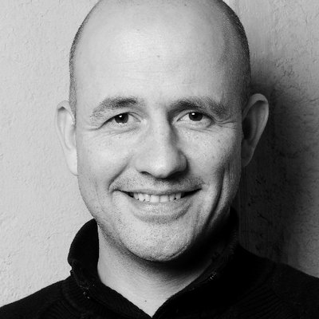

# Author

Alexander Schmidt was born 1978. In 2000 during his studies in Heidelberg / Germany he found a program named 'FrontPage', which was supposed to create websites \(for aesthetic reasons we refrain from giving the company name here\). It was a very popular WYSIWYG editor. The program was quite successful, but Alexander realized very quickly that the real action happens behind the WYSIWYG editor.

At the time of writing Alexander is a lecturer at the Cooperative State University of Mannheim. For Franzis Verlag he wrote some books about Joomla templates, but he discovered that working alone is a much more better way for him to write and publish books.

[alexanderschmidt.info](https://alexanderschmidt.info/)

