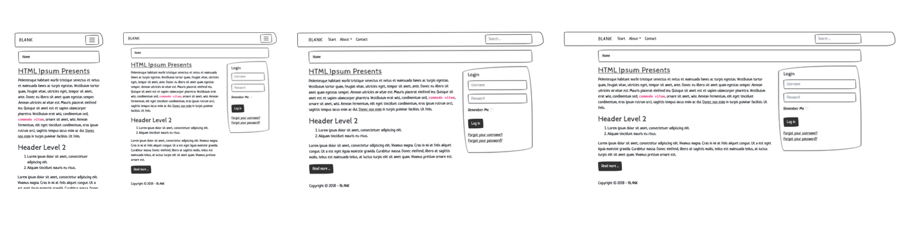

# Bootstrap Tutorial

In this guide you will learn how to use BL4NK with Bootstrap in order to create responsive web design. It will be locally developed. A prerequisite is an installed local web server, Node.js® and - of course - the latest version of Joomla!™ without content. The instructions are written so as you code it in practice, it is often switched back and forth. Only this way the individual steps are easy to understand and the learning effect remains high. The aim is to develop a finished device independent template under the use of Joomla!™, Node.js®, Bootstrap and SASS. Have fun!

## Requirement

* [XAMPP](https://www.apachefriends.org/) or [MAMP](https://www.mamp.info) \(or any local web server\)
* [Joomla!™](https://www.joomla.org/) \(without content\)
* [Node.js®](http://nodejs.org/) \(should be installed\)
* [Gulp](https://gulpjs.com/) \(will be installed\)

What you further need

* [BL4NK Bootstrap Edition](https://github.com/Bloggerschmidt/Blank-Bootstrap-Edition/releases/latest)
* [Sketchy](https://bootswatch.com/sketchy/) Bootstrap Theme

Good to know

* [Bootstrap Documentation](http://getbootstrap.com/)
* [Template Snippets](https://gist.github.com/Bloggerschmidt/2360208)

## Preview



## Installation

First download the latest version of [BL4NK Bootstrap Edition](https://github.com/Bloggerschmidt/Blank-Bootstrap-Edition/releases/latest). Install it in the backend of Joomla!™ under Extensions &gt; Manage &gt; Install &gt; Upload Package File. After successful installation choose the template called _frontend_ as default template under Extensions &gt; Templates &gt; Styles. Now it is active and can be viewed in the front end. Just click on the preview link at the top right. It is recommended to use two tabs in your browser \(back end and front end\) to work with.

Unfortunatly, you have to install the template twice, to automate and enhance your workflow. First keep shure you have installed [Node.js®](http://nodejs.org/). If Node.js® is installed, install Gulp via command prompt. Just open a console or a terminal.

```text
npm install -g gulp-cli
```

Now change your path to the template directory. Install all dependencies.

```text
npm install
```

Run Gulp to compile, compress and build.

```text
gulp
```

Magic!

## Preparation

Before we get into details, you should give your \(!\) template a personal touch. Open the file templateDetails.xml in your template folder under JOOMLA-ROOT/templates/frontend/. This file is an XML file and must be filled in with your data. You can keep the `<name>` frontend. If you want to change your template name into something else, you should do that before \(!\) you install the template. The steps are the same, only that you unzip BL4NK Bootstrap Edition, change the name frontend in templateDetails.xml, rename the folder, zip the template \(the renamed folder\) and install it in the backend. If you want to do it right now, you should deinstall the current template. Keep shure you take another template as default before.

Continue in the templateDetails.xml. The date in `<creationDate>` should be set to the current date. Just take a format you want. Your name is in `<author>` tag. The `<copyright>` follows. `<authorEmail>` and `<authorUrl>` are self explanatory. In `<version>` you can specify which version of the template this is. A description of the templates can be stored under `<description>`. You can use HTML here. The rest can remain as it is for the moment. Later on, when you set the module positions, you will need this file again. Save the file and you'll see that your changes in the backend \(Extensions &gt; Templates &gt; Templates. Yes, you read it right: Double 'Templates'. Do you work as a freelancer? It is awesome to explain this path to your client on the phone\).

BL4NK comes with a little feature called 'browserSync'. Everytime you save your changes in PHP, CSS or JavaScript, the browser will be reloaded automatically. So that can happen you should change the path in gulpfile.js in your template folder. Open the file and search for the `serve` function. Change the line

```javascript
proxy: 'http://localhost/your-website/'
```

to your local developing path, the address of your front end in the browser. E.g.

```javascript
proxy: 'http://localhost/my-awesome-website/'
```

We will get into the other functions later. The template is now ready for development.

Optional, replace the template\_preview.png, template\_thumbnail.png and the favicon.ico with your own. You'll find all three files in the root of your template folder. You can use [this PSD files](http://itr.im/psd) to create your own images.

## index.php

The file index.php is at the heart of each template. This is where all files converge. It is largely responsible for the source code and in the end it's all about creating and influencing the source code. Open it! We go through step by step, before you start coding.

The first line is written in PHP `<?php defined( '_JEXEC' ) or die;`. With `<?php` you open the PHP area \(which should be closed with `?>` again\) and with `defined( '_JEXEC' ) or die` you forbid direct access to this file. This is done via the Joomla!™ API with the \_JEXEC command. This statement checks to see if the file is being called from within Joomla!™ and it protects your site by making it more difficult for a cracker/hacker to damage your site.

With the next line you include the logic.php file.

```php
include_once JPATH_THEMES.'/'.$this->template.'/logic.php';
```

This file holds the variables and program logic of the template. It will be explained after index.php. JPATH\_THEMES is a [constant of Joomla!™](https://docs.joomla.org/Constants) and with `$this->template` we get the current template.

### head

> Zombie, zombie, zombie  
> Hey, hey  
> What's in your head, in your head  
> Zombie, zombie, zombie  
> Hey, hey, hey  
> Oh, do, do, dou, do, do, dou, do, do  
> Dou, do, do, dou, dou, do, do, dou  
> \(Part of the songtext: The Cranberries - Zombie\)

What follows is an HTML document. The declaration of `<!doctype html>`, `<html>` and `<head>`.

```html
<!doctype html>
<html lang="<?php echo $this->language; ?>">
<head>
    <jdoc:include type="head" />
</head>
```

Yo, the first line is the document declaration, second line opens the html area with the attribute `lang` with the site specific language shortcut \(e.g. `en`\). This will be done with php `echo $this->language;`. The head area follows and contains a Joomla!™ specific code to include all the head stuff. With this line the CMS is able to load scripts, links, metas, title and all the invisible but necessary things of your website. If the template is already installed, take a look at the source code of the frontend and you will see all the stuff.

### body

The body contains all the visible stuff of your site.

```html
<body class="<?php echo $active->alias . ' ' . $pageclass; ?>">

    <!--
        SHOW ME YOUR AWESOME CODE
    -->
    <div class="container">
        <div class="row">
            <div class="col-12">
                <jdoc:include type="component" />
                <i class="fas fa-user"></i>
                <i class="far fa-user"></i>
                <i class="fab fa-github-square"></i>
            </div>
        </div>
    </div>

    <jdoc:include type="modules" name="debug" />
    <script src="templates/frontend/build/app.js"></script>
</body>
```

Well, the first line opens the body area with two specific class values: `$active->alias` and `$pageclass`. Maybe you still have recognized it, that every time you create a new menu item in the backend, Joomla!™ creates an alias of this item automatically. It will be created throught the item title in lowercase and empty spaces will be replaced with separators. This alias is predestined to be a class name. So we take it and give it to the body. And yes, at the menu item you are able to leave an extra page class. This page class is also taken for the body class.

The seven lines after `SHOW ME YOUR AWESOME CODE` are example code in the bootstrap way. Three divs contains one jdoc. You can read it in the [official Bootstrap documentation](http://getbootstrap.com/), that containers are required when using the grid system. It uses a series of containers, rows and columns to layout and align content. 'It’s built with [flexbox](https://developer.mozilla.org/en-US/docs/Web/CSS/CSS_Flexible_Box_Layout/Using_CSS_flexible_boxes) and is fully responsive.' The above example creates one column in full width \(the basic grid system has 12 columns\) to display the content of each component of Joomla!™, e.g. articles. This will be done with `<jdoc:include type="component" />` and can only be once in every template. The following three i tags are for preview some icons of Font Awesome \(a solid icon, a regular icon and a brand icon\).

One module follows the component: `<jdoc:include type="modules" name="debug" />`. If you turn on the debug mode in your configuration of your awesome CMS, the output will shown in the frontend in exactly this place. You need to do the same with all your module positions; later more.

Finally, and as an very old developer \(40 y, call me grandpa\) long awaited, the one and only javascript of the website before the closing body tag: `<script src="templates/frontend/build/app.js"></script>`. This file will be created with Gulp. But before going into gulpfile.js, we just take a look at the logic.php. It takes only five minutes.

## logic.php

The logic.php file is being included in the index.php. While the index.php stands for the HTML output, the logic.php represents the programming logic. During template development, it is not unusual that the file is further programmed.

First to make sure that this file is called from Joomla!™ only, the following line is written at top.

```php
<?php defined( '_JEXEC' ) or die;
```

This code prevents that the file can not be accessed from the address bar of your browser.

### Declaring variables

Some variables for the proper use of the template are required. [The basics of PHP variables](http://de2.php.net/manual/en/language.variables.basics.php) can be found in PHP manual \(for beginners: [A simple tutorial in PHP](http://php.net/manual/en/tutorial.php)\).

In a nutshell:

* The first character of each PHP variables is the dollar sign $. This is followed by the variable name.
* Distinction is made between uppercase and lowercase.
* $My\_variable is not the same as $my\_variable or $My\_Variable.
* The dollar sign must be followed by a letter or an underscore \(\_\).
* Spaces are not allowed. $\_my\_variable is okay, $ my\_variable is not.

```php
// variables
$app = JFactory::getApplication();
$doc = JFactory::getDocument();
$menu = $app->getMenu();
$active = $app->getMenu()->getActive();
$params = $app->getParams();
$pageclass = $params->get('pageclass_sfx');
$tpath = $this->baseurl.'/templates/'.$this->template;
```

Most of the variable names are quite self-explanatory. Not so for the contents of the variables, a little explanation is in order. Let's go line by line:

```php
$app = JFactory::getApplication();
```

The variable $app is created, the content in the Joomla!™ framework is called for by the JFactory. The application to which it refers to is Joomla!™ itself, the CMS. The variable $app we will also need for the parameters.

```php
$doc = JFactory::getDocument();
```

Similarly, here comes the variable $doc. Again, we put the Joomla!™ framework to work with the JFactory class. This variable will take care of the RSS feeds within the page, site information, such as the title and description, references to the JavaScript and CSS files being loaded and will do a lot more. However, that is beyond the scope of this book.

```php
$menu = $app->getMenu();
```

This variable points to the menu within the $app variable.

```php
$active = $app->getMenu()->getActive();
```

This variable goes a step further: It looks for the active menu item within the $menu. It also checks if this is the home page or not.

```php
$params = $app->getParams();
```

Using the variable $app we'll query Joomla!™ for the parameters and store that in the variable $params. We will then use to query the page class:

```php
$pageclass = $params->get('pageclass_sfx');
```

A rather aptly named variable, $pageclass. The page class suffix is a parameter in Joomla!™ menu items. It can be set in each menu item: \[Edit\] screen under the "Parameters \(Advanced\)" section. This will order Joomla!™ to either add a new CSS class or modify the existing CSS class for elements in this specific menu item layout.

```php
$tpath = $this->baseurl.'/templates/'.$this->template;
```

That's easy: Variable $tpath contains the relative path to the template directory from the base URL. The $tpath variable is told to look for the active template folder from the base url.

These are all the variables used in BL4NK.

### generator tag

The generator tag tells the world that we build this site with Joomla!™. Something nobody needs to know, least of all undesirables who want to hack your site. Do we want it? No, we most certainly do not!

```php
$this->setGenerator(null);
```

We are the web developers and we are the ones that need to know what the source code actually is. Nobody else should. Hackers need to know what CMS your using, in order to hack it. Why make it any easier than necessary?

Supposing your want to want to tell the world your website runs on Drupal or WordPress? No problem. Just fill in Drupal or WordPress between the single quotes. Or anything that you like:

```php
$this->setGenerator('Drupal');
```

This will generate `<meta name="generator" content="Drupal" />` in the outputted source code of your website.

### Unset JavaScript

As web developer you should have the full power over your website. In order to that you should unset some JavaScripts, because you want to put this JavaScripts in one single file, referenced before the closing body tag. And if you can take this JavaScripts, you can compressing and uglifiying them. This is the best case for performance. However, the following lines unset some scripts.

```php
unset($doc->_scripts[$this->baseurl .'/media/jui/js/jquery.min.js']);
unset($doc->_scripts[$this->baseurl .'/media/jui/js/jquery-noconflict.js']);
unset($doc->_scripts[$this->baseurl .'/media/jui/js/jquery-migrate.min.js']);
unset($doc->_scripts[$this->baseurl .'/media/jui/js/bootstrap.min.js']);
unset($doc->_scripts[$this->baseurl .'/media/system/js/caption.js']);
unset($doc->_scripts[$this->baseurl .'/media/system/js/core.js']);
unset($doc->_scripts[$this->baseurl .'/media/system/js/tabs-state.js']);
unset($doc->_scripts[$this->baseurl .'/media/system/js/validate.js']);
```

Each line calls the unset function. This functions gets access to the document \($doc\), especially to the scripts \(\_scripts\). Then, only the path to each script is needed to execute the function correctly. And yes, not only scripts will be loaded in the head. Some plain JavaScript code appears there too. Muah! Lets unset this.

```php
if (isset($doc->_script['text/javascript']))
{
    $doc->_script['text/javascript'] = preg_replace('%jQuery\(window\)\.on\(\'load\'\,\s*function\(\)\s*\{\s*new\s*JCaption\(\'img.caption\'\);\s*}\s*\);\s*%', '', $doc->_script['text/javascript']);
    $doc->_script['text/javascript'] = preg_replace("%\s*jQuery\(document\)\.ready\(function\(\)\{\s*jQuery\('\.hasTooltip'\)\.tooltip\(\{\"html\":\s*true,\"container\":\s*\"body\"\}\);\s*\}\);\s*%", '', $doc->_script['text/javascript']);
    if (empty($doc->_script['text/javascript']))
    {
        unset($doc->_script['text/javascript']);
    }
}
```

This JavaScript belongs to the image caption and the tooltip via jQuery. We don't need and and if we need it in the future, we will do it the Bootstrap way. Okay, here you need a little structure to control, if the unset is really needed. You do it with a simple if statement. So if some plain script \(text/javascript\) exists \(isset\), then there should be a replacement \(preg\_replace\). One replacement function is looking for some jQuery, that activate the JCaption function, a function for image captions. Another replacement is looking for the hasTooltip function, a function - you guess it right - to activate tooltips.

Keep in mind that some scripts belong in the head, e.g. modernizr. If this is the case you shouldn't unset them. Well done.

You get it off. The head is cleaned from any script.

### Template CSS

To access the one and compressed CSS file of your template, you only need this line:

```php
$doc->addStyleSheet($tpath.'/build/main.css');
```

This will instruct the $doc variable to add main.css by the addStyleSheet function with the path to it. Continue reading to know how this file will be generated.

## gulpfile.js

> gulp is a toolkit for automating painful or time-consuming tasks in your development workflow, so you can stop messing around and build something. ~ [gulp.js](https://gulpjs.com/)

You are using Gulp to get the current version of [Bootstrap](http://getbootstrap.com/) and [Font Awesome](https://fontawesome.com/). Another task of Gulp will be to compile your SASS to CSS and compress it. All JavaScripts will be concatinated and compressed to one file. Last but not least you automate a browser reload after every change, so you havn't to do it manually. All this comes with Gulp plugins and will save your time. Well, lets take a look into the gulpfile.js in your template root folder.

### Declaring variables

To use a plugin in Gulp you have to create a variable for it. With a variable you can write a task to use the plugin for his work.

```javascript
var gulp        = require('gulp');
var concat      = require('gulp-concat');
var sass        = require('gulp-sass');
var uglify      = require('gulp-uglify');
var browserSync = require('browser-sync').create();
```

First gulp itself is declared. concat holds the [gulp-concat](https://github.com/gulp-community/gulp-concat) plugin, to put many files into one file. The plugin [gulp-sass](https://github.com/dlmanning/gulp-sass) will be used as sass compiler to generate and compress your CSS. uglify holds the [gulp-uglify](https://github.com/terinjokes/gulp-uglify) plugin, which is a JavaScript parser, minifier, compressor and beautifier toolkit with [UglifyJS3](https://github.com/mishoo/UglifyJS2). For time-saving synchronised browser testing you're using [browser-sync](https://browsersync.io/). All these plugins will be installed when you install the template through `npm install`.

### Current Bootstrap

It's time for the first Gulp task called 'bootstrap' to get the new versions of - you guess it right - Bootstrap.

```javascript
gulp.task('bootstrap', function() {
    return gulp.src('node_modules/bootstrap/scss/**/*')
        .pipe(gulp.dest('scss/bootstrap'));
});
```

After installing the template via npm the Node.js® package manager gets the current versions of Bootstrap and copies the files in a specific folder. This folder will be used as source folder to get all files in there, your are using placeholders like \*\* and \*. The first placeholder \*\* is for any directory in the folder, the second \* for any file. The destination folder for the files is the scss and the font folder of the template.

### Compiling SASS

To compile your SASS to CSS the gulpfile.js contains another task called 'sass'.

```javascript
gulp.task('sass', function() {
    return gulp.src(['scss/main.scss'])
        .pipe(sass({outputStyle: 'compressed'}))
        .pipe(gulp.dest('build'))
        .pipe(browserSync.stream());
});
```

First line is to declare the task 'sass' as a function. It will take the main.scss as source and compile and compress it with the sass plugin. The final destination is the build folder in your template directory. After that the browser should be reload automatically through browserSync.

### Uglifying JavaScript

The code to bring all JavaScripts together is written in the task 'js'.

```javascript
gulp.task('js', function() {
    return gulp.src([
        'node_modules/jquery/dist/jquery.slim.min.js',
        'node_modules/popper.js/dist/umd/popper.min.js',
        'node_modules/bootstrap/dist/js/bootstrap.min.js',
        'js/script.js'
        ])
        .pipe(concat('app.js'))
        .pipe(uglify())
        .pipe(gulp.dest('build'))
        .pipe(browserSync.stream());
});
```

Four files should be the source. The first three belongs to Bootstrap and the last one called script.js is for your own scripting. With concat your will bring them together. After that only one file is left: 'app.js'. This file will be minified and compressed before put it into the build folder of your template. Finally the browserSyn reloads your browser automatically. Magic!

### Starting a server

Well, you don't want to call every task manually after a change. Gulp can do it for your by watching all necessary files and after a change, it runs the specific task.

```javascript
gulp.task('serve', ['sass'], function() {
    browserSync.init({
        // server: './'' // default server
        // proxy: 'http://localhost:8888/' // mamp
        proxy: 'http://localhost/your-website/' // usualy
    });
    gulp.watch('js/**/*.js', gulp.series('js'));
    gulp.watch('scss/**/*.scss', gulp.series('sass'));
    gulp.watch('*.php').on('change', browserSync.reload);
});
```

This task 'serve' initializes the browserSync by watching all php, js and scss files of your template. To run it correctly change the proxy path with the path of your browser address \(e.g. '[http://localhost/blank5/](http://localhost/blank5/)'\). This is the address of your Joomla!™ frontend. So if you change your script.js the task 'js' will be done and if you change your \_custom.scss the task 'sass' will be done. Sexy.

### Default tasks

To start Gulp you only type `gulp` into your command line interface \(cli\). As default it should run all tasks in a specific order.

```javascript
gulp.task('default', gulp.parallel('bootstrap','sass','js','serve'));
```

This task runs the following tasks parallel: bootstrap, sass, js and serve.

## Navbar

Back to index.php. Its time to code. For the menu and the search you use the [Bootstrap Navbar](http://getbootstrap.com/docs/4.0/components/navbar/) and apply them to Joomla!™. Copy the following lines and paste them after the body tag.

```html
<!-- NAVBAR -->
<nav class="navbar navbar-expand-lg navbar-light bg-light">
  <div class="container">
    <a class="navbar-brand"
      href="<?php echo $this->baseurl; ?>/">
       <?php echo $app->getCfg('sitename'); ?>
    </a>
    <button class="navbar-toggler"
      type="button"
      data-toggle="collapse"
      data-target="#nav-modules"
      aria-controls="nav-modules"
      aria-expanded="false"
      aria-label="Navigation"
    >
      <span class="navbar-toggler-icon"></span>
    </button>
    <div class="collapse navbar-collapse"
      id="nav-modules"
    >
      <jdoc:include type="modules" name="navbar" />
    </div>
  </div>
</nav>
```

The code looks harder than it is. Roughly speaking, it is here there to display the page name, the menu and the search on one line next to each other. On the left side the site name with the menu, and to the right a search box. Remark this in the code with comments, so later on you can find it back more easily.

First, you open a div with the class `navbar navbar-expand-lg navbar-light bg-light`. Bootstrap creates a \(responsive\) navigation menu. Its horizontal padding is removed at breakpoints lower than the specified `navbar-expand-lg` class. This ensures your are not doubling up on padding unnecessarily on lower viewports when your navbar is collapsed. Theming the navbar will be done by `navbar-light bg-light`. You can try `navbar-dark bg-dark` or `navbar-dark bg-primary` as well \(take a look at [Color shemes](http://getbootstrap.com/docs/4.0/components/navbar/#color-schemes)\). Although it’s not required, you can wrap a navbar in div with the class `container` to center it on a page.

What follows is the link to the site name. The class `navbar-brand` formats the presentation of the site name. The Joomla!™ API gives you a target \(href\) to the base URL. Important here is the slash \(/\) at the end. If you open a tag you have to close it, too. Normally you do it separat \(e.g. `<div></div>`\) but you can do it the short way \(e.g. `<div />`\), when no value between the opening and closing tag is needed. About the predefined variable $app you have to get the site name from the configuration and display it.

With the site name on the left the toggle button comes on the right. The toggler appears only on small devices. Its a `button` with the class `navbar-toggle`. The `data-toggle` attribute has the value `collapse`, so the navigation can toggle in and out. The target \(attribute `data-target`\) is the ID `#nav-modules`. Below you write in a div with the same ID \(`#navbar-modules`\) a module position called `navbar`.

Look at the result in the frontend. Apart from the site name nothing to see. Both the menu and the search should be created in the backend. But first we need to set the module positions.

## Module positions

In order to do it right you should define all module positions in the file templateDetails.xml. So the system has access to and the backend user can publish modules at this defined positions. Open the file in an editor of your choice and scoll to `<positions>`. There you'll find one predefined position called "debug". Add the following code:

```html
<position>navbar</position>
<position>breadcrumbs</position>
<position>largebar</position>
<position>sidebar</position>
```

What? These are already listed? Well the template seems to be well written, hehe. Okay, the names are self-explanatory \(always use a good naming convention!\). The login should be published at the "sidebar" position. Maybe later you want to add another module there, so the name "sidebar" is better than "login" for this position. The "largebar" is intended for visitors with large displays. One you defined the module positions, save and close the file.

## Boilerplate text

Now it'is time to make some preparations in the backend. You create a blank article for building the menu. First create an item with some boiler plate text. Click in Content &gt; Articles &gt; New and set the title "HTML Ipsum Presents". You can copy the following text:

```html
<p><strong>Pellentesque habitant morbi tristique</strong> senectus et netus et malesuada fames ac turpis egestas. Vestibulum tortor quam, feugiat vitae, ultricies eget, tempor sit amet, ante. Donec eu libero sit amet quam egestas semper. <em>Aenean ultricies mi vitae est.</em> Mauris placerat eleifend leo. Quisque sit amet est et sapien ullamcorper pharetra. Vestibulum erat wisi, condimentum sed, <code>commodo vitae</code>, ornare sit amet, wisi. Aenean fermentum, elit eget tincidunt condimentum, eros ipsum rutrum orci, sagittis tempus lacus enim ac dui. <a href="#">Donec non enim</a> in turpis pulvinar facilisis. Ut felis.</p>

<h2>Header Level 2</h2>

<ol>
   <li>Lorem ipsum dolor sit amet, consectetuer adipiscing elit.</li>
   <li>Aliquam tincidunt mauris eu risus.</li>
</ol>

<blockquote><p>Lorem ipsum dolor sit amet, consectetur adipiscing elit. Vivamus magna. Cras in mi at felis aliquet congue. Ut a est eget ligula molestie gravida. Curabitur massa. Donec eleifend, libero at sagittis mollis, tellus est malesuada tellus, at luctus turpis elit sit amet quam. Vivamus pretium ornare est.</p></blockquote>

<hr id="system-readmore" />

<h3>Header Level 3</h3>

<ul>
   <li>Lorem ipsum dolor sit amet, consectetuer adipiscing elit.</li>
   <li>Aliquam tincidunt mauris eu risus.</li>
</ul>

<pre><code>
#header h1 a {
  display: block;
  width: 300px;
  height: 80px;
}
</code></pre>
```

This text was written by Chris Coyiers on his site [html-ipsum.com](http://html-ipsum.com/) and is called Kitchen Sink. It's a good boiler plate text with some elements, that might be appear on your website. Before the third title `<h3>` we place a "Read more" link. Well, make it a featured article \(Featured &gt; Yes\) and Save & Close it. Now under Options &gt; Articles hide the following entries near the bottom:

* Show Icons &gt; Hide
* Show Print Icon &gt; Hide
* Show Email Icon &gt; Hide
* Show Hits &gt; Hide

Open the frontend in another tab to preview the result. Ah, yeah! Looks good.

## Menu

Now we can build a two-level menu. Go to Menus &gt; Main Menu and create some new entries, each as "Single Article", "Link" to "Lorem Ispum" and "Link Class" "nav-link". It is important that the parent entry of the second level \(in our case "About"\) get the menu item type "System Links &gt; URL" and as "Link" the route sign \(\#\), with the "Link Class" "nav-link dropdown-toggle". Only so it drops correctly under bootstrap. The structure should look something like this:

* Home  \[1\]
* About \[2\]
  * Vulputate Aenean \[3\]
  * Euismod Vestibulum Sit \[3\]
  * Ligula \[3\]
* Contact \[3\]
* Articles &gt; Featured Articles 'Link Class' \(Link Type\) `nav-link`
* System Links &gt; URL 'Link Class' \(Link Type\) `nav-link dropdown-toggle`
* Articles &gt; Single Article 'Link Class' \(Link Type\) `nav-link`


The parent element "About" should not \(!\) be assigned to an article. This is to be liable to the "Mobile First Strategy". Have you previously been accustomed under the parent element into view something, you can instead add below a summary page as the first element.


Now it is time to publish the menu in the right position. Edit the module of the menu in Extensions &gt; Modules &gt; Main Menu \(or create it if it doesn't exist\) and publish it in the position `navbar`. When you create a drop-down menu, 'Show Sub-menu Items' should be set to "Yes". In 'Menu Class Suffix' \(Advanced\) you set the class `navbar-nav mr-auto` \(preceded by a space!\). Save & Close. Refresh your browser page \(frontend\).

Looks good? No, it doesn't. On the second level you'll see some slack. What we need are some extra classes according to the [Bootstrap documentation of the navbar](http://getbootstrap.com/docs/4.1/components/navbar/). We'll add them in one override. There is a long way to do this, so pack a pair sandwiches and a bottle of water, and then go to Extensions &gt; Templates &gt; Templates \(again\) &gt; Frontend Details and Files &gt; Create Overrides &gt; Modules &gt; mod\_menu. One click on mod\_menu creates the override in your template directory in the html folder. Now open the file default.php in there.

The line 24

```php
$class = 'item-' . $item->id;
```

gets an extra class `nav-item`.

```php
$class = 'nav-item item-' . $item->id;
```

The line 87

```php
echo '<ul class="nav-child unstyled small">';
```

will be replaced with

```php
echo '<ul class="dropdown-menu" aria-labelledby="navbarDropdown'.$item->id.'">';
```

Save it. What can I say? Without these additions our navbar won't work. This additional attribute makes the drop functional. Well, unfortunatly we can't get it all in the override. We have to write some JavaScript to make it finally work. Muah! Open the file script.js in the js folder of your template. It should be almost empty. Add some jQuery stuff like the following.

```javascript
jQuery(function($) {

  // dropdown menu
  $('ul.dropdown-menu').each(function(){
    $(this).prev().attr({
      id: $(this).attr('aria-labelledby'),
      role: 'button',
      'data-toggle': 'dropdown',
      'aria-haspopup': 'true',
      'aria-expanded': 'false'
    });
  });

});
```

Ooo...kay. With the first line we open the jQuery function in generell and with the last line we close it. The inner code is for each dropdown menu. Before every single dropdown menu there is a button to trigger it. For example it look like this.

```html
<a href="#" class="nav-link dropdown-toggle">...</a>
<ul class="dropdown-menu" aria-labelledby="navbarDropdownXXX">
```

The idea is to take every `ul` with the class `dropdown-menu`, take the value of the attribute `aria-labelledby` and give it to the sibling before `a` as an id.

```javascript
$('ul.dropdown-menu').each(function(){
  $(this).prev().attr({
    id: $(this).attr('aria-labelledby')
  });
});
```

And the way we add the id we can add the other attributes `role`, `data-toggle`, `aria-haspopup` and `aria-expanded` as well.

Save. Upload. Done. Browser: refresh. View. Be proud. Applause!

## Search

To improve the user experience offering a search module is a good idea. You can use the module position `navbar`, but the corresponding module in the backend won't work yet. Do that in Extensions &gt; Modules. Click on "New" and select "Search". The 'title' should perhaps be named "Search" and the position `navbar`. Save & Close.

It still looks a little bit ugly. The label before the box can actually be removed. Therefore we create another override. You are strengthened by sandwiches and water? Then go to Extensions &gt; Template Manager&gt; Templates &gt; Frontend Details and Files &gt; Create Overrides &gt; Modules &gt; mod\_search. A click on mod\_search again creates the override in the template directory in the folder html. Go into the same directory, look for mod\_search open the file default.php.

First delete the class `form-inline` from the form element. There is only one class, so you can delete the whole attribute. By deleting the class you keep shure, that the search input field takes the full width even in mobile view.

```php
<form action="<?php echo JRoute::_('index.php'); ?>" method="post" class="form-inline">
```

to

```php
<form action="<?php echo JRoute::_('index.php'); ?>" method="post">
```

Comment out the following line.

```php
$output = '<label for="mod-search-searchword' . $module->id . '" class="element-invisible">' . $label . '</label> ';
```

to

```php
// $output = '<label for="mod-search-searchword' . $module->id . '" class="element-invisible">' . $label . '</label> ';
```

Remove the dot `.` before the equal sign on line above and give the input element the additional classes `form-control mr-sm-2`:

```php
$output .= '<input name="searchword" id="mod-search-searchword' . $module->id . '" maxlength="' . $maxlength . '"  class="inputbox search-query input-medium" type="search"' . $width;
```

to

```php
$output = '<input name="searchword" id="mod-search-searchword' . $module->id . '" maxlength="' . $maxlength . '"  class="inputbox search-query input-medium form-control mr-sm-2" type="search"' . $width;
```

\(Note: With the dot you can attach other values to variables, here HTML. However, attach the first assignment of a value must be done without a dot.\) So, well done. The search looks responsive beautiful.

## Breadcrumbs

The visitor of your site should always know where he is. You help him by displaying the navigation path, also knows as breadcrumbs \(from the fairy tale Hansel and Gretel, where Hansel drops his breadcrumbs to know the path home\). In the file index.php you need to add few lines of code. Place it below the navbar.

```html
<!-- BREADCRUMBS -->
<div class="container mt-3">
  <jdoc:include type="modules" name="breadcrumbs" />
</div>
```

The div class `.container` refers to the [grid system bootstrap](http://getbootstrap.com/docs/4.1/layout/grid/) we earlier discussed, so that the Breadcrumb module has the correct place in the template. Bootstrap offers us some [spacing utilities](https://getbootstrap.com/docs/4.1/utilities/spacing/). With the class `mt-3` we force a space with margin `m` to the top `t` of three rem `-3`.

The work in the index.php is done. Now it needs a module for the navigation path. So go to the module manager in the backend: Extensions &gt; Modules. Create the breadcrumbs module by clicking on "New" and select the type "Breadcrumbs". The 'Title' can be anything you want, but keep it simple. Maybe just call it “Breadcrumbs" is a good idea? Set the position to `breadcrumbs`. Getting hungry from all those breadcrumbs? Take a short break. After refreshing yourself go to options in the breadcrumbs module and set 'Show "You are here"' to "No". Save & Close.

If you now click on a sub-item in the front end, you see, that there is still a rather ugly arrow in orange. Muah! It's simply to beautiful to keep it. Time for an override for mod\_breadcrumbs \(you know how it goes :-\). open the file default.php.

Search for:

```php
<?php echo $separator; ?>
```

comment out the `$separator` and write your own, maybe

```php
<?php //echo $separator; ?>&nbsp;&gt;&nbsp;
```

And that, ladies and gentlemen, makes our breadcrumbs shining bright.

## Content and Sidebar

Now it gets time to work on the content and the sidebar. Place the following code in your index.php under the breadcrumbs:

```html
<!-- CONTENT -->
<div class="container">
  <div class="row">

    <!-- content -->
    <div class="col-12 col-md-8">
      <jdoc:include type="message" />
      <jdoc:include type="component" />
    </div>

    <!-- sidebar -->
    <div class="col-12 col-md-4">
      <jdoc:include type="modules" name="sidebar" style="card" />
    </div>

  </div>
</div>
```

In order to use the grid system of Bootstrap correctly, you need two divs from the classes: `container` and `row`. In it you place two columns: One for the money, two for the show. ... Uh! ... I mean: One for the content, two for the sidebar. Both columns get the full width on mobile with `col-12`. The content should be bigger on tabletts and desktops, so it get `col-md-8` for eight columns for medium devices and above. The sidebar should have half width of the content. Therefore it gets `col-md-4`.

In out grid system we put some Joomla!™ stuff in there. With `<jdoc:include type="message" />` you spit the news of the Joomla!™ system and `<jdoc:include type="component" />` the content \(via component\). In the sidebar comes the same module position with `style="card"`. This module chrome named "card" does not yet exist. We'll do that in the next step.

To write your own module chrome, you need to create the file modules.php in the html folder. There you write following code:

```php
<?php defined('_JEXEC') or die;

function modChrome_card($module, &$params, &$attribs) {
  if ($module->content) {
    echo "<div class=\"card " . htmlspecialchars($params->get('moduleclass_sfx')) . "\">";
    echo "<div class=\"card-body\">";
    if ($module->showtitle) {
      echo "<h5 class=\"card-title\">" . $module->title . "</h5>";
    }
    echo $module->content;
    echo "</div>";
    echo "</div>";
  }
}

?>
```

You know now why the first line is there? Yes, only Joomla!™ is allowed to execute this file. Otherwise you will die. That's sounds hard, but it ondy works this way. What follows is a PHP function called "modChrome\_card", in which the module is placed with the div class card. If you want to know exactly what it is about this module chrome, then read the section [Module Chrome](https://schmidt.gitbook.io/bl4nk/bl4nk-1\#module-chrome).

If you refresh the frontend you will see a ugly thing: The read more button. This button missed a class called `btn-primary`. This thing need this class to look good. And it would like to look good \(like you and me\). Create Overrides &gt; Layouts &gt; joomla &gt; content. Go to the folder html/layouts/joomla/content and open the file readmore.php. All other files could be deleted. You don't need them. Now catch all anchor elements with the class `btn` and add `btn-primary`.

```html
<a class="btn" ...>
```

becomes

```html
<a class="btn btn-primary" ...>
```

Save and refresh the frontend. By now, the content looks good, but what's about the login?

## Login

Ah, yes! The Login. The sidebar is ready for it. Now we'll create the login module. Go to the backend under Extensions > Modules, create it by clicking on "New" and choosing "Login". The 'title' can be called "Login". Publish it in the sidebar position. Save & Close.

This doesn't look as sexy as it could. You guess it right. An override with a few classes will remedy this problem. Create an override mod\_login in the html folder via backend and open the default.php.

First remove the class `form-inline` from form element. You can remove the whole attribute.

```html
<form action="<?php echo JRoute::_('index.php', true, $params->get('usesecure')); ?>" method="post" id="login-form" class="form-inline">
```

to

```html
<form action="<?php echo JRoute::_('index.php', true, $params->get('usesecure')); ?>" method="post" id="login-form">
```

Next replace all classes `input-small` with `form-control` (search and replace is your friend). Continue to replace all classes named `control-group` with the class `form-group`. All `<label>` get the class `sr-only`. Looking for the `ul` with the class `unstyled` and rewrite it like the following.#

```html
<ul class="list-unstyled">
```

To avoid destroying the menu, delete or comment the two following lines at the begin of the file.

```php
// JHtml::_('behavior.keepalive');
// JHtml::_('bootstrap.tooltip');
```

[Author's note: The implementation of bootstrap in the frontend is really a plague.] Save. Looks good.

## Footer

Last but not least we will code the footer. A oneliner should be enough for the first. In the file index.php we write following code.

```html
<div class="container footer">
  <p><br />Copyright &copy; <?php echo date('Y'); ?> -
      <?php echo $app->getCfg('sitename'); ?></p>
</div>
```

This shows the copyright symbol, the current year and the site name.

## Theme

Congratulations! You finished your first site with BL4NK and Bootstrap and it looks really good. If you want to style your site with a different theme, that can be done.

Go to [bootswatch.com](http://bootswatch.com/) and pick a theme you like. Maybe you prefer Sketchy, so let's take that one. Create a folder named bootswatch in the "scss" directory of your template. Download the files _variables.scss and _bootswatch.scss, copy them into the folder "scss/bootswatch/". Import both files before the bootstrap variables import in file main.scss.

```scss
@import "bootswatch/variables";  // <-- new
@import "bootswatch/bootswatch"; // <-- new
@import "bootstrap/variables";
```

And that, my friends, is all you need to do... Simple, once you know it. And you do it now!

~ TUTORIAL END ~ 

